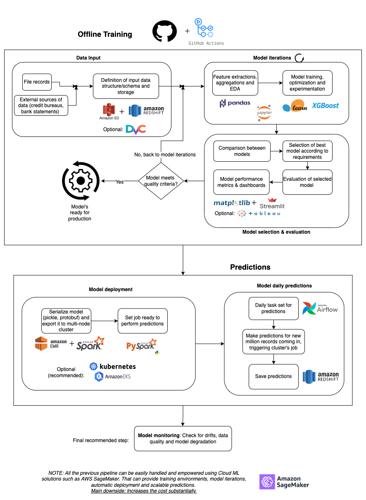

# MLOps Sample Pipeline Design

## Case Challenge
### Background
Certain Fintech enriches transaction data with transaction categories. This information is useful,
among others, for Personal Finance Management services (pfms) that want to offer products to
their customers based on this information. The end goal of the exercise is to improve the
efficiency of the machine learning engineers working on transaction categorization modeling.

### Problem definition

#### Model training
The model is trained offline manually by a ML engineer.

The dataset consists of some million files like [this one](https://www.kaggle.com/datasets/sufyant/brazilian-real-bank-dataset).
Each file represents a credit card
account. Each file needs to be processed. This processing consists of row by row data
cleaning/preparation and calculation of new features that can depend on: the row’s data,
aggregates for the whole file, and data from external services.
Model selection and model evaluation are treated in different steps in order to ensure
comparability between models.
Once a model passes certain quality criterias it can be deployed by the ML engineer into
production.
#### Prediction task
On a daily basis a few million files like the one described in the previous step needs to be
processed and a prediction for each of the rows has to be made. The whole process is part of
other pipelines and should not take more than half an hour.

---

### Part 1: Machine Learning Pipeline Design
According to the requirements and stages needed for the classification problem, the next pipeline diagram
is proposed:

The next sections explain in detail the proposed pipeline.

#### Offline Training
The offline training starts by considering `GitHub + GitHub Actions` the main starting points. As any model iteration, training involves lots of different versioning processes along with tasks and unit tests needed in place when developing new versions. Given that, GitHub (repo host provider by excellence) and GitHub Actions (CI/CD for development and testing) sounds like a good start. Once both are set for the new classification model, the offline training starts.
Note: Python would be considered for all stages that need a programming language unless specified otherwise.

---

##### Data Input
The data input process involves two main steps given the nature of the problem. First, for millions of files to be processed, we need a storage capable of scaling as we need and to have faster retrieval times and easiness of use. Here, `S3 storage` can be considered to store all these files with easy-to-use SDKs. Depending on the structure of these files, there's probably certain pre-processing needed before storing the raw files. Now, for the external sources of data (credit bureaus, bank statements, personal information from other vendors, among others), we also need some pre-processing and retrieval steps to make sure the files and the information comes as expected. Usually, document grinding tasks can be leveraged here to extract the meaningful information out of financial files, most commonly being in XML or JSON formats.  
Once these files (both records and external) are processed, a data warehouse can be used to store the final transformed data for further training purposes. `Amazon Redshift` fits correctly here given its native integration with S3 and its SQL enriched capabilities to retrieve data.  
_Optional: `DVC` can be used to version the data to be used when training. This data can be retrieved from S3 or Redshift and can be versioned for different model datasets, similar to the idea of versioning repositories with Git._

---

##### Model Iterations
Once the data was transformed and served inside the needed data warehouse, it's time to start the model iterations. The first step should involve looking for critical pieces of it such as missing fields, corrupted files, type mismatches and unexpected edge cases. Once the data is prepared, we can perform an EDA throughout the data. This exploration will allow us to understand deeper the features and metadata present in all the files and records. We can start performing feature extractions and aggregations in order to find the most impactful set that makes sense according to the business outcome required. We can also perform some techiques such as feature reduction (dimensionality reduction) trying to come up with the best set of features that will indeed make the model infere correctly the final classes expected but reducing the complexity of the final model. All this feature analysis can be performed using `pandas` library within `Jupyter Notebooks`.  
After the final set of features has been defined, we can start training the models selected for the specific classification purpose. As the data comes mainly in tabular form (from both file records and external sources), `Gradient Trees` are one initial preferred solution in order to perform the classification. These gradient trees can be modeled then using libraries such as `scikit-learn` or `XGBoost`. As per the data analysis, `Jupyter Notebooks` can be used for training purposes. These notebooks can be hosted either locally or within `EC2 instances` with more computational resources. As the data will be located within S3 and Redshift, the EC2-hosted notebooks can also communicate easily with these locations.  
As there are going to be different models to be trained (different hyperparameters, different baseline training data, different targets or even different set of features), some tools for tracking and registering experiments can be used. After all these iterations and all model outcomes are saved, we're ready to compare models and select the one that fits the best within the outcome requirements.  

--- 

##### Model selection & evaluation
As there are different models to be compared, we can start by comparing directly the metrics for the results that can be important for classification, such as `ROC AUC`, `F1 score`, `accuracy`, among others. As the models are directly trying to estimate categories, `the confusion matrix & related metrics` are very relevant as well. Also, these models can be compared by the time and space complexity, impacting directly into the resources they're going to need once they're in production and the time they take to make the inferences. Then, we can perform `k-fold cross-validation` between them so we can directly test them for different sets of training, testing and validation sets.  
Once the best model is selected, it gets evaluated directly according to the requirements previously defined. These could be in terms of resources, inference times, business needs, final user use easiness, among others. This evaluation should lead to establish the final training metrics and calibration of it.  
Finally, all these metrics and results can be exported to visualization dashboards, so the decision of choosing that model can be well-founded and presented to all stakeholders. These visualizations can be achieved using `matplotlib + Streamlit`, the latest being one technology that allows Machine Learning and Data Science teams to share data codes and models using a web-based application to see the results. This allows to perform predictions, display charts and visualize the results using a web app with few lines of code, amazing!  
_Optional: If the team needs to keep collaborating together with dashboards & visualizations, `Tableau` could be a solution to consider. Different teams can all share knowledge through it if it's worth the initial complexity of setting it up._

---

##### Is it time to make it into production?
Finally, the model is evaluated to check if it meets the minimum quality criteria to be out in production. If it does, then the model is handed to the engineer in charge of deploying it. If not, the model should be taken back to the model iteration stage, so it can be adjusted accordingly.  

---

#### Predictions
The model's ready to be deployed and make predictions with it. 

##### Model deployment
Usually, we'd package the model within a container, and we'd deploy it so other users can make predictions with it or internally if needed. For this specific problem, as we need to process few million files per day within a 30-min window, the process needs some specific big-data requirements. In order to make predictions with it, we need to serialize the model (using any format such as regular pickle binary or protobuf schemas) and we need to export it into big data processors. For this model, we can use `AWS EMR + Spark` to do the heavy-lifting job. This allows us to take full power of distributed worker nodes in order to parallelize most of the predictions needed to be made. This multi-node cluster can be set up with the prediction job once the model has been serialized and exported, then we can use `PySpark` to write the script needed to trigger this job from an external call. The idea here is to make the model ready to be triggered just by calling this defined job.  
_Optional: EMR itself can be adjusted to use `Kubernetes` clusters. Kubernetes is proposed as optional if there are different infrastructure needs for the Data Science team and other units as well. The main power of k8s is that we can spin up resources as needed for machine learning models and `AWS EKS` can handle all the distributed nodes for us._

---

##### Model daily predictions
In order to make daily predictions, an `Airflow DAG` can be created so it's composed of specific tasks:
* Retrieve new data files and records (if needed) and store them in S3/Redshift
* Trigger the Spark job to make the predictions needed for all new records of the day
* Save all predictions within Redshift for further analysis and visualizations.  
These tasks can be achieved within the time window expected if the needed resources are allocated within the EMR cluster. This DAG can run daily and can be adjusted to inform the model owners or other pipelines once it's done, so all other processes can continue normally.

---

#### Bonus #1: Model Monitoring
Although it's possibly not a requirement (yet), we can set up a process of model monitoring in order to look for drifts, data quality issues and model degradation. This is a critical yet unset stage for most machine learning pipelines. For a critical space like finance, it'd be very useful to early detect possible issues with the models in production so action can be taken before it impacts negatively the business.

---

#### Bonus #2: SageMaker
`Amazon SageMaker` is a very important and useful tool within the ML picture. It can help with the whole process of getting data and training models, up to delivering models into production depending on the needs. The main downside is its cost and easiness of use for new modelers. So, if SageMaker already exists within the company's scope, it'd be great to use it for most of the steps for this pipeline. 

---

### Part 2: Implementation of one system within the pipeline
From all systems and stages shown in the proposed pipeline, the **Model daily predictions** was chosen, and it's explained next.  

_Assumptions and simplifications_: As the original pipeline involves setting up an EMR Cluster along with a Spark job to be triggered and that can be an overhead for this challenge, the next assumptions were made:
* A random model is going to be serialized and loaded within a Docker container simulating it to be the EMR Cluster ready to run the Spark job. This model is a topic classifier previously trained for other purposes. One single API endpoint will be defined to trigger the prediction job.
* The model container will use Flask to expose the endpoint and Swagger to document it and interact easily with it.
* Airflow and all its dependencies will be on their own containers.
* The Spark job can be triggered within Airflow using a SparkSubmitOperator. As Spark isn't going to be launched here, we will replace that operator by a PythonOperator that performs a call to the container's endpoint.
* To handle both model container and Airflow containers, `docker-compose` will be used.

#### How to run it?
In order to run the prediction's system, follow the next steps:
* First, clone this repository to your computer.
* Now, let's launch the containers
  * If `Make` command can be run, run `make all` and just wait for all containers to come alive. Both Airflow server & dependencies and model containers should be launched.
  * If not:
    * Run `docker-compose up airflow-init` and wait for the Airflow database server to come alive
    * Run `docker-compose up` and wait for the rest of Airflow dependencies and model container to come alive
* Go to `localhost:5000/apidocs` if you want to inspect the model container and its `prediction` endpoint
* Go to `localhost:8080` to check the current DAGs. Should appear just one DAG: `daily_predictions`. Whenever you're ready, turn it on (if not on already)!
* Once the DAG completes the run, you should be able to see something like `{python.py:...} INFO - Done. Returned value was: Predictions made by dd/mm/yyyy: ['SPORTS', 'TECH', 'WEIRD NEWS']` inside the logs of any `perform_predictions_task`. Those are the predictions for the input files being tested.
  * Note: The DAG is set to run hourly but the starting date is one day ago, so it will try to get up to date for the past day running the missing schedules. As the mmodel container is also being launched and it can take few minutes to be ready to accept requests, the first runs may fail, while the last ones should succeed.
* That's it!  
_Note: The whole process can be quite heavy and can take a fair amount of resources if running it locally. Make sure Docker has enough memory allocated for it_  

---

### Part 3: Design of solution for future pipeline requirements
The proposed pipeline can change according to certain scenarios:
#### Predictions needed to be produced in real time (<1s)
For real time predictions, the deployment solution should involve real-time serving for the model using `Docker` containers to package the model and any web framework to expose prediction endpoints such as `Flask` (used in the simulated component for previous part) or `FastAPI`. These containers can be hosted in `ECS` or in `EKS` if there's a running Kubernetes cluster. This way, through the API endpoint, the users can make HTTP calls to get real time predictions.
#### The model had to be retrained on a regular basis taking into account user feedback
For retraining purposes, there are certain pieces that have to be considered:
* As there's already a CI/CD pipeline in place, new models can be retrained and deployed following an automated process. 
* Once the model is retrained (an `AWS Lambda` function can be created for this purpose for example), it's possible to retro-score all existing records using the same Spark cluster. That way, new models can be compared with existing ones, leading to better conclusions about the performance of all developed models.
* As the user feedback is important, dashboards are critical for visualizing the performance of the models involving all stakeholders.
* Also, a new endpoint (if containerized solutions are being considered) can be created within the containers to refit/retrain the models for new data. This endpoint can be capable of retraining the model, serializing it, exporting/serving it as needed and triggering the predictions job for retro-scoring for existing records. Retro-scoring means predicting the classes for the records that were already processed in the past and their results already exist within the data warehouse.
#### Different versions of the model could be trained and served on a self-served manner
Using some ideas mentioned before, this can be achieved either by considering `AWS Lambda` functions, using `Airflow` DAGs as their full power or leveraging the power of `GitHub Actions` so the new models can be automatically served and deployed following the existing deployment process.  
If `SageMaker` is within the scope, this process can be way easier to set up. An Airflow DAG can be created, so it can trigger every month (for example) the process of retraining the model. During this process, a new model is trained with the new training dataset considered and, after that, the new model can be uploaded to the model/artifact registry solution being considered (SageMaker Model Registry). That way, SageMaker will be in charge of registering the model, updating the existing catalog of models and taking it into production if it gets approved. Self-served models are on its way!
